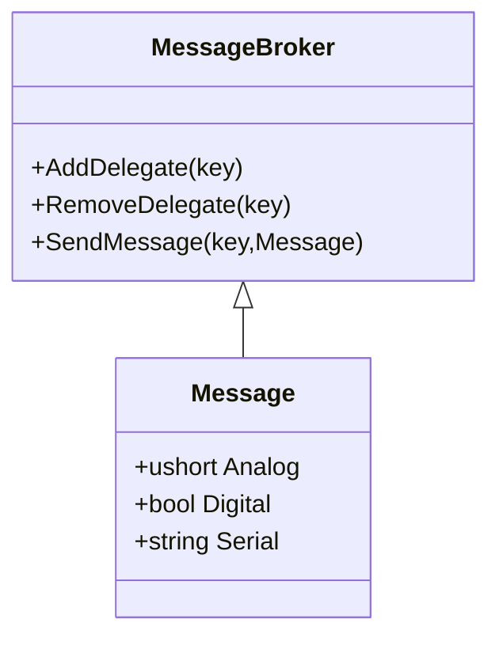
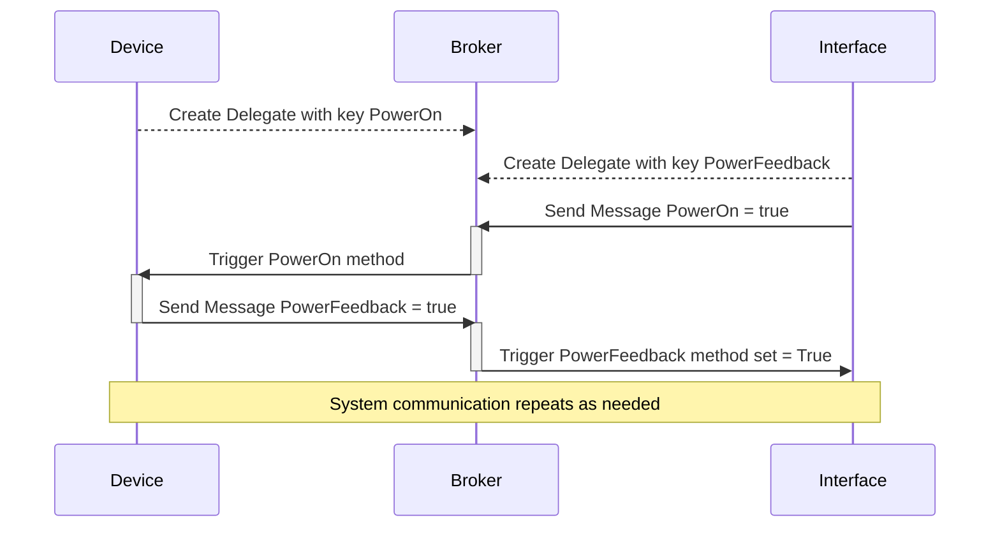

      

# Masters 2024 MSS-521 Conference Room Program Example

 This is a Conference room program that is written in C# for VC-4 or 4Series Appliance and leverages HTML5/CH5 user interface with Contracts for signals.   This program has an Airmedia, NVX, Apple TV, and a Crestron Connected Display  the NVX is used as a global source receiver for the buildings shared video resources.  The AppleTV could be  changed out for a HD-EXT4 to deliver a 4K capable table input if the customer desired.

**After Masters Update :** Master2024 had a short lab built into this for the class to get familiar with looking around in the contract files to find what was needed to complete the subpage display code.   it is presented here as it is only 6 lines of code.    The answer to the Masters Lab is as follows and is found in the MainPage.cs file at the bottom of the MainPage Class.

```c#
    private void ShowMainSubpages(int page)
    {
        // Hide all the AV subpages
        _myContract.MainPage.MediaControl.MediaControl_Visibility(false);
        _myContract.MainPage.AirMediaInfo.AirMediaInfo_Visibility(false);
        _myContract.MainPage.NvxInfo.NvxInfo_Visibility(false);

        switch (page)
        {
            case 0:
                _myContract.MainPage.MediaControl.MediaControl_Visibility(true);
                break;
            case 1:
                _myContract.MainPage.AirMediaInfo.AirMediaInfo_Visibility(true);
                break;
            default:
                _myContract.MainPage.NvxInfo.NvxInfo_Visibility(true);
                break;
        }
    }
```


 **IMPORTANT NOTE:** These are **<u>simplified</u>** classes in this program for students to use to learn concepts from.  They are not 100% complete in regards to error testing and error recovery or hardening. It is left up to the students to complete the work and finish the C# code in the classes  on their own when they progress to that level.   Do not expect this to be ready to use in a production environment. 

Please take note how this program  has both documentation, and comments in the code.   These things are considered a best practice both by CTI and the programming industry in general, and should be a part of every type of code you write.    


#### Message System

This example program leverages a Message broker to communicate across all the classes in the program so that a context hell is not created  and you start succumbing under the weight of abstractions, and the complex graph of promiscuously shared mutable objects.  The messaging system makes this easy by leveraging delegates. 




**NOTE:** Remember this messaging system is extremely simplified and basic. We pass an object that has 3 pieces.  Analog, Digital, Serial.  Yes I chose those names so that they match Simpl.

You simply create a subscription from a KEY to a method that supports the Message object.

```C#
        MessageBroker.AddDelegate("DisplayPower", DisplayPower);
           
        private void DisplayPower(Message m)
        {
            switch (m.Digital)
            {
                case true:
                    MyCrestronConnected.On();
                    break;
                case false:
                    MyCrestronConnected.Off();
                    break;
            }
        }
```

All the broker is doing is storing a delegate pointing at the method you specify, and assigning the key.  Because the MessageBroker is static it exists everywhere all the time as a single instance.  It holds the keys to the kingdom and can be seen from everything in your program.  

So how do we call this?  Below is an example

```C#
        MessageBroker.SendMessage("DisplayPower", new Message { Digital = true });
```

All we do is send a message to the key that contains that Message object. that message triggers the Message Broker to call the method we created the Delegate for and sends the message object to it.   That is all it does while greatly simplifying how to make class A trigger a method in Class B when they both are not even aware of each other.


#### Crestron Contracts

Crestron touch panels traditionally used joins.  numbers that specify what data is what with separate join numbers for Digitals, Analogs and Serials from the touch panel or user interface to your program and back. This has been a challenge to manage in very large programs for some programmers and when the team has a user interface designer that is not the software developer a disconnect can get even more difficult to manage.   CH5/HTML5 brings in Contracts.  we can now use names to talk to the user interface and get information back.    For example...

```C#
   _myContract.HeaderBar.RoomNameLabel_IndirectText("MSS-521 Conference Room");
```

The HeaderBar Object has a RoomNameLabel Object in it that we can set the text.  every property you expose in the contract is available in C# for you to access and modify or create an event when it changes on the user interface side by user interaction.

``` C#
      _myContract.StartPage.Button_PressEvent += StartPage_Button_PressEvent; // On
```

In the Conference room Program, there is a folder called "Contract" inside the User Interface folder that contains all of the C# code generated by Crestron Construct that greatly simplifies leveraging Contracts for you.   If a property you want to control is not on the object, this means the contract was not enabled in Crestron Construct and you need to go back and enable it,  recompile, and then re-import the code generated.   this is as simple as drag and drop from the folder view into VS2022.  More details on Crestron Contracts, Crestron Construct, and CH5 are available at http://help.crestron.com


#### Program Command Line Commands on Appliances

This program has two items useable on an appliance from the command line for debugging. There is no command line interface for VC-4 therefore these commands will not work on that platform.

**brokerlist**  -  This will list all current subscribed keys to the broker

**brokermon [on:off]** - This will enable printing to console when messages are sent to the key with a time stamp.  issuing brokermon on will turn this on.   it will self turn off on program restart or reboot.

These commands are here for debugging the broker system and seeing how things are flowing  to your messaging broker.  if a message is sent, it will get triggered if the key exists.

#### Program Design and Flow

This program is broken into many different classes to keep them small and easily maintained and organized.   Driver classes for hardware exist to contain the hardware and the DeviceSetup class brings them all into the program and sets up any Message Broker connections that are needed. The Xpanel Class sets up the user interface and has several classes it leverages to organize the different pages.  this also sets up where page flips and feedbacks create Message Broker connections.  Button press event handlers here can be pointed at the Message handler keys for operation.  No room operation code exists in these classes. only creation of delegates and calls.  Code to perform page navigation lives in the PageNavagation class here.   The Automation Class contains the operational code for the room. All just Message Broker calls and some logic perform the operation of the system. There is a Timer class for a hardcoded timer to shutdown the room at night in case it was left on.

All operation of the hardware and inter class communication flows through the messaging system.  a button press to switch sources, triggers the automation SourceSelect() to tell the display to go to hdmi1, the nvx to switch it's input, and update the touch panels feedback.  



In this case not only can the Device and Interface not see each other, they are not even aware each other exists. This also allows us to create a separate class for automation that only handles messages.   If we were to rip out the hardware and swap it for something else, as long as out message keys remain the same and the operation of the hardware matches the framework design, no code changes in the operation will be needed.  This also makes expansion easier.  Adding a motion sensor to turn the room on when someone enters?  simply add the hardware and trigger the SystemOn message. 

Note:  This very simplified message broker system supports many to one communication and is a basic framework for you to expand upon as your needs change.


#### Things to Note

As mentioned at the beginning, this program is not 100% complete and ready for you to start using at customers locations. You will notice that real hardware has some real life delays.  NVX switching from HDMI1 and HDMI2 take time as the video source renegotiates the connection.  Apple TV takes time to negotiate HDCP so protected sources can take longer to switch.   NVX stream switching is very fast, but depending on the display used a high end laser projector or LCD TV comes on within 3-5 seconds, but other displays will not.  This means adding in a "please wait" type of subpage to let the customer know things are working.  Also 3rd party devices over the network or RS232 can be very sporadic and inconsistent in their data flows.   If you are using the NVX analog audio out the analog ramping is smooth as butter.  an Espon Projector's volume feedback happens when it wants to tell you. so it may be fast, it may be slow, it may not update for a half a second or more until you stop ramping.  This will make the volume feedback look strange to the customer.  this means you need to smooth it out and make it look good to the customer in your code.   The Epson laser projector I tested this code on also would miss sending feedback being unmuted when volume is ramped up or down. you will need to track it yourself and then update the actual status to true feedback later when you poll the projector.   All of these challenges you had to deal with in the SIMPL programming world, so this is not new.    It is up to you as a student to make the program complete and robust with delivering a good smooth user experience.  


## How to Use Crestron Drivers in C#

In this repository is a folder "CrestronDriversInCSharp" this contains all the code from the second half of the class presentation about the use of Crestron Drivers in C# as presented by Diamonds Chris MacGilfrey and Dustin Bransford.  This covers a TCP display, but this applies to  all other types of drivers except for IR.  Those you simply unzip and load the IR driver inside to the IR port you want to use.


## License

Crestron example code is licensed to Crestron dealers and Crestron Service Providers (CSPs) under a limited non-exclusive, non-transferable Software Development Tools License Agreement. Crestron product operating system software is licensed to Crestron dealers, CSPs, and end-users under a separate End-User License Agreement. Both of these Agreements can be found on the Crestron website at www.crestron.com/legal/software-license-agreement. The product warranty can be found at www.crestron.com/legal/sales-terms-conditions-warranties. The specific patents that cover Crestron products are listed at www.crestron.com/legal/patents. Certain Crestron products contain open source software. For specific information, visit www.crestron.com/legal/opensource-software. Crestron, the Crestron logo, Crestron Virtual Control, VC-4, 4-Series, 4-Series Control System, Crestron Studio, Crestron Toolbox, Crestron XiO Cloud, SIMPL+, and VT-Pro e are either trademarks or registered trademarks of Crestron Electronics, Inc. in the United States and/or other countries. Microsoft Visual Studio and Active Directory is either a trademark or a registered trademark of Microsoft Corporation in the United States and/or other countries. Other trademarks, registered trademarks, and trade names may be used in this document to refer to either the entities claiming the marks and names or their products. Crestron disclaims any proprietary interest in the marks and names of others. Crestron is not responsible for errors in typography or photography. ©2024 Crestron Electronics, Inc.